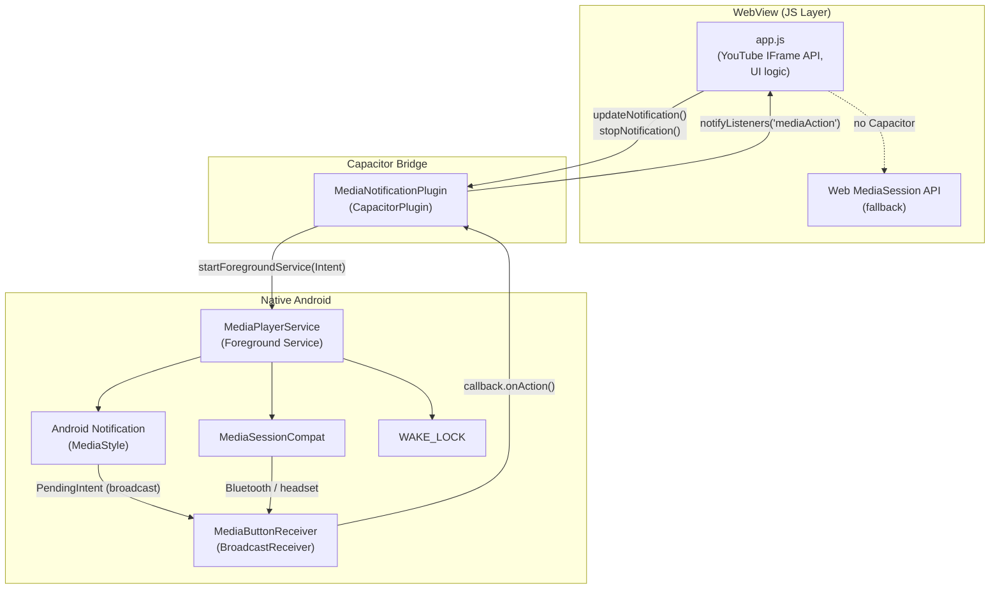

# Design Document

## Feature: android-player-ui-background

---

## Overview

Данный дизайн описывает три взаимосвязанных улучшения Android-приложения VioletTunes (Capacitor + нативный Android):

1. **Адаптивный мобильный UI** — нижняя навигация (Bottom Nav), touch-friendly Player Bar, полноэкранный Player Screen, свайп-жесты.
2. **Медиа-уведомление** — постоянное уведомление в шторке с обложкой, кнопками управления и MediaSession.
3. **Фоновое воспроизведение** — Foreground Service с WAKE_LOCK, синхронизация состояния JS ↔ Native через Capacitor-плагин.

Приложение построено на Capacitor: веб-часть (HTML/CSS/JS) работает в WebView, нативный Android-код обеспечивает системную интеграцию. Существующая архитектура уже содержит `MediaPlayerService`, `MediaNotificationPlugin` и `MediaButtonReceiver` — дизайн расширяет и дорабатывает их.

---

## Architecture



**Поток данных:**
- JS → `updateNotification()` → Capacitor Plugin → `startForegroundService` → Service обновляет уведомление и MediaSession
- Кнопка в уведомлении → BroadcastReceiver → Plugin callback → `notifyListeners` → JS обрабатывает действие → снова `updateNotification()`

---

## Components and Interfaces

### 1. CSS / Web UI Layer

#### Bottom Navigation (`#bottomNav`)
- Новый элемент `<nav id="bottomNav">` добавляется в `index.html` после `<footer class="player-bar">`.
- Содержит 4 пункта: Главная, Поиск, Для тебя, Избранное — каждый с SVG-иконкой и подписью.
- Видим только при `@media (max-width: 767px)`.
- `position: fixed; bottom: calc(var(--player-h) + env(safe-area-inset-bottom)); left: 0; right: 0; z-index: 50`.
- При клике вызывает существующую функцию `showPage(pageId)` и обновляет активный класс.

#### Player Bar (мобильная адаптация)
- При `max-width: 767px`: `width: 100%; height: 72px; padding-bottom: env(safe-area-inset-bottom)`.
- Упрощённый layout: обложка 48×48px, название+исполнитель, кнопка лайк, кнопка play/pause.
- Клик на область (кроме кнопок) открывает Player Screen.

#### Player Screen (`#playerScreen`)
- Новый элемент `<div id="playerScreen" class="player-screen hidden">` поверх всего контента.
- `position: fixed; inset: 0; z-index: 200`.
- Содержит: обложку (min 240×240px), название, исполнителя, прогресс-бар с временными метками, кнопки Prev/Play/Next, Shuffle/Repeat, Like.
- Фон: dominant color из обложки (Canvas API) или фиолетовый градиент по умолчанию.
- Закрывается свайпом вниз (touchstart/touchmove/touchend) или кнопкой «↓».

#### Touch Targets
- Все кнопки плеера: `min-width: 44px; min-height: 44px`.
- Элементы списка треков: `min-height: 56px`.
- Свайп на треке: threshold 40px для активации действия.

### 2. Capacitor Plugin — `MediaNotificationPlugin`

Существующий плагин, требует доработки:

```java
@CapacitorPlugin(name = "MediaNotification")
public class MediaNotificationPlugin extends Plugin {
    void load()                          // регистрирует MediaButtonReceiver.callback
    void updateNotification(PluginCall)  // запускает/обновляет Foreground Service
    void stopNotification(PluginCall)    // останавливает Foreground Service
}
```

**Изменения:**
- Добавить дедупликацию: хранить последние переданные данные, пропускать UPDATE если данные не изменились.
- Добавить rate-limiting: не отправлять UPDATE чаще раза в 500ms.

### 3. `MediaPlayerService` (Foreground Service)

Существующий сервис, требует доработки:

```java
public class MediaPlayerService extends Service {
    // Состояние
    static String  currentTitle, currentArtist, currentCover;
    static boolean isPlaying, isLiked;
    private String lastLoadedCover;          // NEW: для дедупликации обложки
    private PowerManager.WakeLock wakeLock;  // NEW: WAKE_LOCK

    // Методы
    void onCreate()           // создаёт канал, MediaSession, запрашивает WAKE_LOCK
    int  onStartCommand()     // обрабатывает UPDATE / STOP
    void loadCoverAndNotify() // загружает обложку в фоне (ExecutorService вместо AsyncTask)
    void showNotification()   // строит и показывает уведомление
    void onDestroy()          // освобождает MediaSession, WAKE_LOCK
}
```

**Изменения:**
- Заменить устаревший `AsyncTask` на `ExecutorService` + `Handler(Looper.getMainLooper())`.
- Добавить timeout 5 секунд для загрузки обложки (`Future.get(5, TimeUnit.SECONDS)`).
- Добавить дедупликацию обложки: если `currentCover.equals(lastLoadedCover)` — не перезагружать.
- Добавить `PowerManager.WakeLock` с тегом `"VioletTunes:playback"`.
- Добавить `onTaskRemoved()` для остановки при смахивании из recent.

### 4. `MediaButtonReceiver` (BroadcastReceiver)

Существующий класс, изменений не требует. Принимает broadcast-интенты от кнопок уведомления и передаёт действие через статический callback в Plugin.

### 5. JS Layer — `app.js`

**Новые функции:**
```javascript
// Player Screen
function openPlayerScreen()          // показывает #playerScreen, извлекает dominant color
function closePlayerScreen()         // скрывает #playerScreen
function extractDominantColor(img)   // Canvas API → dominant color для фона
function setupSwipeToClose()         // touchstart/touchmove/touchend на playerScreen

// Bottom Nav
function initBottomNav()             // инициализирует клики на #bottomNav
function updateBottomNavActive(page) // обновляет активный пункт

// Swipe on track items
function setupTrackSwipe(el, track)  // горизонтальный свайп на элементе трека
```

**Изменения в существующих функциях:**
- `updatePlayerUI(track)` — дополнительно обновляет Player Screen если он открыт.
- `onYTState(e)` — при resume из фона синхронизирует UI.
- `setupNativeMediaButtons()` — уже реализован, без изменений.

---

## Data Models

### Track (существующий)
```typescript
interface Track {
  id:     string;   // YouTube video ID
  name:   string;   // название трека
  artist: string;   // исполнитель
  cover:  string;   // URL обложки (может быть пустым)
  src:    'youtube' | 'soundcloud';
}
```

### NotificationPayload (JS → Native)
```typescript
interface NotificationPayload {
  title:   string;   // название трека
  artist:  string;   // исполнитель
  cover:   string;   // URL обложки (может быть пустым)
  playing: boolean;  // текущее состояние воспроизведения
  liked:   boolean;  // текущее состояние лайка
}
```

### MediaAction (Native → JS)
```typescript
interface MediaAction {
  action: 'play' | 'pause' | 'next' | 'prev' | 'like' | 'stop';
}
```

### PlayerScreenState (JS internal)
```typescript
interface PlayerScreenState {
  isOpen:        boolean;
  dominantColor: string | null;  // CSS color string или null
  swipeStartY:   number;
  swipeCurrentY: number;
}
```

### ServiceState (Android static fields)
```java
// MediaPlayerService static state
String  currentTitle   // текущий заголовок
String  currentArtist  // текущий исполнитель
String  currentCover   // URL текущей обложки
boolean isPlaying      // состояние воспроизведения
boolean isLiked        // состояние лайка
String  lastLoadedCover // последняя успешно загруженная обложка (дедупликация)
```

---

## Correctness Properties

*A property is a characteristic or behavior that should hold true across all valid executions of a system — essentially, a formal statement about what the system should do. Properties serve as the bridge between human-readable specifications and machine-verifiable correctness guarantees.*

### Property 1: Bottom Nav navigation consistency

*For any* пункта Bottom Nav (Главная, Поиск, Для тебя, Избранное), нажатие на него должно делать соответствующую страницу активной и визуально выделять именно этот пункт, а все остальные пункты должны быть невыделены.

**Validates: Requirements 1.3**

---

### Property 2: Player controls touch target size

*For any* кнопки управления плеером (play, pause, prev, next, shuffle, repeat, like), её вычисленный размер должен быть не менее 44×44px.

**Validates: Requirements 3.1**

---

### Property 3: Track list item touch target size

*For any* элемента списка треков, его высота должна быть не менее 56px.

**Validates: Requirements 3.2**

---

### Property 4: Swipe cancellation below threshold

*For any* расстояния горизонтального свайпа менее 40px, действие (лайк или удаление из плейлиста) должно быть отменено и элемент трека должен вернуться на исходную позицию.

**Validates: Requirements 3.5**

---

### Property 5: Notification reflects track data

*For any* трека с непустыми полями title и artist, вызов `updateNotification` должен приводить к тому, что уведомление отображает именно этот title и artist.

**Validates: Requirements 4.2**

---

### Property 6: Play/Pause button reflects playing state

*For any* значения флага `playing` (true или false), кнопка в уведомлении должна отображать «Пауза» если playing=true и «Воспроизведение» если playing=false.

**Validates: Requirements 5.2**

---

### Property 7: Like button reflects liked state

*For any* значения флага `liked` (true или false), иконка кнопки лайка в уведомлении должна быть активной (закрашенной) если liked=true и неактивной если liked=false.

**Validates: Requirements 5.3**

---

### Property 8: MediaSession metadata reflects track data

*For any* трека, вызов `updateNotification` должен обновлять `MediaMetadataCompat` так, что `METADATA_KEY_TITLE` и `METADATA_KEY_ARTIST` соответствуют переданным title и artist.

**Validates: Requirements 6.2**

---

### Property 9: PlaybackState reflects playing flag

*For any* значения флага `playing`, `PlaybackStateCompat` должен быть `STATE_PLAYING` если playing=true и `STATE_PAUSED` если playing=false.

**Validates: Requirements 6.3**

---

### Property 10: JS state changes trigger updateNotification

*For any* изменения состояния в JS-слое (смена трека, play/pause, toggle лайка), функция `updateNotification` должна быть вызвана в течение 300ms с актуальными данными.

**Validates: Requirements 8.1, 8.5**

---

### Property 11: Cover deduplication prevents redundant loads

*For any* последовательности вызовов `updateNotification` с одинаковым значением `cover` URL, загрузка обложки должна происходить не более одного раза.

**Validates: Requirements 9.3**

---

### Property 12: Notification update rate limiting

*For any* серии вызовов `updateNotification` с интервалом менее 500ms, количество фактических обновлений уведомления не должно превышать одного обновления на каждые 500ms.

**Validates: Requirements 9.2**

---

## Error Handling

### Загрузка обложки
- **Ошибка сети / невалидный URL**: `MediaPlayerService` перехватывает исключение в `ExecutorService`, вызывает `showNotification(null)` — уведомление показывается с иконкой приложения.
- **Timeout > 5 секунд**: `Future.get(5, TimeUnit.SECONDS)` бросает `TimeoutException`, загрузка отменяется, вызывается `showNotification(null)`.
- **Повторная загрузка той же обложки**: пропускается через сравнение `currentCover.equals(lastLoadedCover)`.

### Capacitor Bridge недоступен
- JS-слой проверяет `window.Capacitor?.isNativePlatform?.()` перед каждым вызовом плагина.
- При `false` — используется `navigator.mediaSession` как fallback (уже реализовано в `setupMediaSession()`).
- Все вызовы плагина обёрнуты в `try/catch` с `console.warn`.

### MediaPlayerService lifecycle
- `onTaskRemoved()`: вызывает `stopForeground(true)` и `stopSelf()` при смахивании из recent.
- `onDestroy()`: освобождает `mediaSession.release()` и `wakeLock.release()` (если удерживается).
- `START_STICKY`: сервис перезапускается системой после принудительного завершения (кроме `onTaskRemoved`).

### YouTube IFrame Player ошибки
- `onError` callback: показывает toast «Ошибка воспроизведения», вызывает `playNext()`.
- Уведомление обновляется с `playing: false` при ошибке.

### Swipe gesture отмена
- Если `deltaX < 40px` при `touchend` — элемент возвращается на место через CSS `transition: transform 0.2s`.
- Если `deltaX >= 40px` — действие выполняется, элемент анимируется за экран.

---

## Testing Strategy

### Dual Testing Approach

Используется комбинация unit-тестов (конкретные примеры и граничные случаи) и property-based тестов (универсальные свойства).

### Property-Based Testing

Для JS-слоя используется библиотека **fast-check** (TypeScript/JavaScript).
Для Android-слоя используется **jqwik** (Java property-based testing).

Каждый property-тест запускается минимум **100 итераций**.

Теги тестов: `Feature: android-player-ui-background, Property N: <text>`

**JS property tests (fast-check):**

| Property | Что тестируется | Генераторы |
|----------|----------------|------------|
| P1: Bottom Nav navigation consistency | `showPage()` + active state | `fc.constantFrom('home','search','foryou','liked')` |
| P2: Player controls touch target size | computed style кнопок | `fc.constantFrom(кнопки плеера)` |
| P3: Track list item touch target size | computed height track-item | `fc.array(fc.record({id, name, artist, cover, src}))` |
| P4: Swipe cancellation below threshold | swipe < 40px → no action | `fc.integer({min:0, max:39})` |
| P10: JS state changes trigger updateNotification | updateNotification вызван ≤ 300ms | `fc.oneof(play/pause/next/prev/like events)` |

**Android property tests (jqwik):**

| Property | Что тестируется | Генераторы |
|----------|----------------|------------|
| P5: Notification reflects track data | title/artist в уведомлении | `@ForAll String title, artist` |
| P6: Play/Pause button reflects playing state | кнопка play/pause | `@ForAll boolean playing` |
| P7: Like button reflects liked state | иконка лайка | `@ForAll boolean liked` |
| P8: MediaSession metadata reflects track data | MediaMetadata title/artist | `@ForAll String title, artist` |
| P9: PlaybackState reflects playing flag | STATE_PLAYING/STATE_PAUSED | `@ForAll boolean playing` |
| P11: Cover deduplication | загрузка обложки 1 раз | `@ForAll String coverUrl, @ForAll int repeatCount` |
| P12: Notification rate limiting | ≤ 1 update per 500ms | `@ForAll List<Long> updateTimestamps` |

### Unit Tests

**JS (Jest + jsdom):**
- Bottom Nav: 4 пункта присутствуют, position: fixed, safe-area-inset-bottom
- Player Bar: высота ≥ 72px при < 768px, клик открывает Player Screen
- Player Screen: все элементы присутствуют, свайп вниз закрывает
- Dominant color: при null cover применяется дефолтный градиент
- Fallback: при отсутствии Capacitor используется navigator.mediaSession
- mediaAction listener: зарегистрирован при инициализации
- stopNotification: вызывает stopForeground + stopSelf

**Android (JUnit + Robolectric):**
- `MediaPlayerService.onCreate()`: канал создан, MediaSession активен, WAKE_LOCK запрошен
- `onStartCommand(STOP)`: stopForeground + stopSelf вызваны
- `onTaskRemoved()`: сервис останавливается
- `onDestroy()`: mediaSession.release() вызван
- Notification VISIBILITY_PUBLIC
- MediaStyle с setShowActionsInCompactView(0,1,2)
- Timeout обложки > 5s: уведомление без обложки
- Ошибка загрузки обложки: уведомление с иконкой приложения

### Integration Tests

- Foreground Service запускается при вызове `updateNotification` (Espresso/UI Automator)
- Уведомление появляется в шторке в течение 500ms
- Нажатие кнопки уведомления доставляет событие в JS в течение 200ms
- Bluetooth MediaSession action → MediaButtonReceiver → JS event
- Воспроизведение продолжается при сворачивании приложения
- Смахивание из recent → сервис останавливается

### Smoke Tests

- Bottom Nav: `position: fixed` в computed style
- Bottom Nav: `padding-bottom: env(safe-area-inset-bottom)` в CSS
- Notification: `VISIBILITY_PUBLIC`
- MediaStyle: `setShowActionsInCompactView(0, 1, 2)`
- MediaSession: создан и активен
- MediaSession: поддерживает ACTION_PLAY, ACTION_PAUSE, ACTION_SKIP_TO_NEXT, ACTION_SKIP_TO_PREVIOUS
- WAKE_LOCK: запрошен в `onCreate()`
- MediaSession: освобождается в `onDestroy()`
- Загрузка обложки: происходит не в Main Thread
