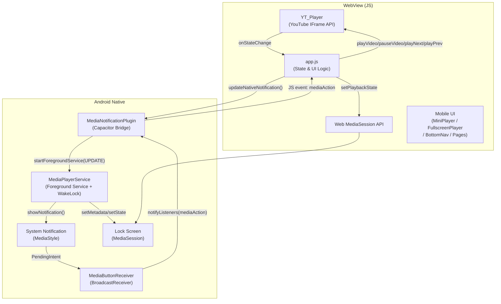

# Design Document: Mobile UI & Background Playback

## Overview

Фича охватывает два взаимосвязанных направления:

1. **Мобильный UI** — переработка интерфейса под сенсорный экран: скрытие боковой панели, нижняя навигация (`BottomNav`), компактный `MiniPlayer` над ней, полноэкранный `FullscreenPlayer` с анимацией slide-up, страницы `SearchPage`, `LikedPage`, `PlaylistsPage`, `ForYouPage`, `MyMusicPage`.

2. **Фоновое воспроизведение** — устранение разрыва между JS-плеером (YouTube IFrame API) и нативным Android-сервисом: `MediaPlayerService` как Foreground Service с `WakeLock`, синхронизация состояния через `MediaNotificationPlugin`, управление из уведомления и экрана блокировки через `MediaButtonReceiver`.

Инфраструктура уже частично готова: `MediaPlayerService`, `MediaNotificationPlugin`, `MediaButtonReceiver` существуют и зарегистрированы в `AndroidManifest.xml`. Нужно:
- Устранить пробелы в JS-стороне (вызовы `updateNativeNotification`, `setupNativeMediaButtons` уже есть в `app.js`, но требуют доработки).
- Добавить `WakeLock` в `MediaPlayerService`.
- Переработать CSS/HTML для мобильного layout.
- Реализовать `FullscreenPlayer` как оверлей.
- Добавить страницы `MyMusicPage` и `PlaylistsPage` как отдельные страницы (сейчас плейлисты открываются через модальное окно).

---

## Architecture



**Ключевые потоки:**

- **JS → Native**: `app.js` вызывает `updateNativeNotification()` при каждом изменении состояния `YT_Player` → `MediaNotificationPlugin.updateNotification()` → `MediaPlayerService` обновляет уведомление и `MediaSession`.
- **Native → JS**: Пользователь нажимает кнопку уведомления → `MediaButtonReceiver` → `MediaNotificationPlugin.notifyListeners("mediaAction")` → `app.js` обрабатывает событие.
- **WakeLock**: `MediaPlayerService` удерживает `PARTIAL_WAKE_LOCK` пока сервис запущен как Foreground Service.

---

## Components and Interfaces

### 1. CSS / HTML — Mobile Layout

**Изменения в `style.css`:**

```
@media (max-width: 767px) {
  .sidebar        → display: none
  .app            → grid-template-columns: 1fr (убрать sidebar column)
  .player-bar     → grid-column: 1/2, height: 64px (MiniPlayer)
  #bottomNav      → display: flex (сейчас скрыт или не стилизован для мобайла)
  .main           → padding-bottom: calc(64px + 56px) (MiniPlayer + BottomNav)
}
```

**`#bottomNav`** — уже присутствует в `index.html`. Нужно добавить CSS:
- `position: fixed; bottom: 0; width: 100%; height: 56px`
- Кнопки минимум 48×48dp
- Активный пункт подсвечивается `var(--accent)`

**`MiniPlayer`** — переработанный `player-bar` на мобайле:
- Занимает всю ширину, высота 64px
- Расположен над `BottomNav` (`bottom: 56px`)
- Тап на область трека (не на кнопки) → открывает `FullscreenPlayer`

### 2. FullscreenPlayer

Новый HTML-элемент `#fullscreenPlayer` — фиксированный оверлей поверх всего контента.

```html
<div id="fullscreenPlayer" class="fullscreen-player hidden">
  <div class="fsp-header">...</div>       <!-- кнопка закрыть / свайп-индикатор -->
  <div class="fsp-cover">...</div>        <!-- обложка 240×240dp+ с анимацией -->
  <div class="fsp-meta">...</div>         <!-- название, исполнитель -->
  <div class="fsp-progress">...</div>     <!-- прогресс-бар + время -->
  <div class="fsp-controls">...</div>     <!-- prev, play/pause, next, like, repeat, shuffle -->
</div>
```

**Анимация открытия:** CSS `transform: translateY(100%)` → `translateY(0)` за 300мс.

**Закрытие свайпом вниз:** Touch events (`touchstart`, `touchmove`, `touchend`) — если `deltaY > 80px` → закрыть.

**Синхронизация прогресса:** Переиспользует существующий `progressTimer` (интервал 500мс) — обновляет и `MiniPlayer`, и `FullscreenPlayer` одновременно.

**Анимация обложки:** CSS `animation: spin 8s linear infinite` при `isPlaying === true` (аналогично существующему `heroVinyl.spinning`).

### 3. MyMusicPage

Новая страница `#pageMyMusic` — агрегатор «Избранное» + «Мои плейлисты».

```html
<div class="page" id="pageMyMusic">
  <div class="topbar">...</div>
  <div class="mymusic-content">
    <div class="mymusic-section" id="mmLikedSection">...</div>
    <div class="mymusic-section" id="mmPlaylistsSection">...</div>
  </div>
</div>
```

Кнопка «Плейлисты» в `BottomNav` (`#btnMobileLibrary`) переключается с модального окна на эту страницу.

### 4. PlaylistsPage

Отдельная страница `#pagePlaylistsMain` со списком всех плейлистов (сейчас это только модальное окно). Тап на плейлист → `openPlaylistPage(id)` (уже существует).

### 5. MediaPlayerService — WakeLock

**Добавить в `MediaPlayerService.java`:**

```java
import android.os.PowerManager;

private PowerManager.WakeLock wakeLock;

@Override
public void onCreate() {
    super.onCreate();
    PowerManager pm = (PowerManager) getSystemService(POWER_SERVICE);
    wakeLock = pm.newWakeLock(PowerManager.PARTIAL_WAKE_LOCK, "VioletTunes::MediaWakeLock");
    ...
}

// При старте Foreground Service:
if (!wakeLock.isHeld()) wakeLock.acquire();

// При STOP:
if (wakeLock.isHeld()) wakeLock.release();

@Override
public void onDestroy() {
    if (wakeLock != null && wakeLock.isHeld()) wakeLock.release();
    ...
}
```

`START_STICKY` уже возвращается в `onStartCommand` — это обеспечивает перезапуск сервиса системой.

### 6. JS — updateNativeNotification (доработка)

Функция `updateNativeNotification` уже существует в `app.js`. Нужно убедиться, что она вызывается:
- В `onYTState` при `PLAYING` и `PAUSED` (уже есть)
- В `updatePlayerUI` при смене трека (уже есть)
- При `toggleLikeTrack` для текущего трека (нужно добавить)

**Добавить в `toggleLikeTrack`:**
```js
if (tracks[currentIndex]?.id === track.id) {
    updateNativeNotification(track, isPlaying, !wasLiked);
}
```

### 7. JS — setupNativeMediaButtons (доработка)

Функция уже существует и вызывается при инициализации. Нужно добавить обработку `'stop'`:
```js
case 'stop':
    if (ytPlayer?.pauseVideo) ytPlayer.pauseVideo();
    stopNativeNotification();
    break;
```

---

## Data Models

### TrackObject (JS)
```typescript
interface Track {
  id: string;        // YouTube video ID
  name: string;      // Название трека
  artist: string;    // Исполнитель
  cover: string;     // URL обложки
  src: 'youtube';    // Источник
}
```

### ListenHistoryEntry (localStorage: `vt_history`)
```typescript
interface ListenHistoryEntry {
  id: string;
  name: string;
  artist: string;
  cover: string;
  playCount: number;
  totalSec: number;
  lastPlayed: number;  // timestamp ms
  keywords: string[];
}
```

### Playlist (localStorage: `vt_playlists`)
```typescript
interface Playlist {
  id: number;        // Date.now()
  name: string;
  icon: string;      // emoji
  tracks: Track[];
}
```

### NotificationPayload (JS → Android через Capacitor)
```typescript
interface NotificationPayload {
  title: string;
  artist: string;
  cover: string;    // URL или пустая строка
  playing: boolean;
  liked: boolean;
}
```

### MediaAction (Android → JS через Capacitor event)
```typescript
interface MediaActionEvent {
  action: 'play' | 'pause' | 'next' | 'prev' | 'like' | 'stop';
}
```

### FullscreenPlayerState (JS runtime)
```typescript
interface FullscreenPlayerState {
  isOpen: boolean;
  touchStartY: number | null;
  coverAnimating: boolean;
}
```

---

## Correctness Properties

*A property is a characteristic or behavior that should hold true across all valid executions of a system — essentially, a formal statement about what the system should do. Properties serve as the bridge between human-readable specifications and machine-verifiable correctness guarantees.*

### Property 1: Уведомление содержит актуальные данные трека и корректный статус воспроизведения

*For any* трека и любого перехода состояния `YT_Player` (play/pause), вызов `updateNativeNotification` должен произойти в течение 100мс, переданные `title`, `artist`, `cover`, `liked` должны совпадать с данными текущего трека, а флаг `playing` — с фактическим состоянием плеера.

**Validates: Requirements 5.1, 5.2, 3.3, 3.4, 4.8**

### Property 2: Событие кнопки уведомления вызывает правильное действие плеера

*For any* действия кнопки уведомления (`play`, `pause`, `next`, `prev`, `like`), соответствующий метод `YT_Player` или функция приложения должны быть вызваны ровно один раз.

**Validates: Requirements 4.2, 4.3, 4.4, 4.5, 4.6, 4.7**

### Property 3: Прогресс-бар FullscreenPlayer синхронизирован с YT_Player

*For any* момента воспроизведения, значение прогресс-бара в `FullscreenPlayer` должно отличаться от `YT_Player.getCurrentTime()` не более чем на 500мс.

**Validates: Requirements 2.3**

### Property 4: Seek через FullscreenPlayer изменяет позицию YT_Player

*For any* позиции ползунка прогресс-бара в диапазоне [0, duration], после перетаскивания `YT_Player.getCurrentTime()` должен вернуть значение, соответствующее выбранной позиции (±1 сек).

**Validates: Requirements 2.4**

### Property 5: Форматирование времени

*For any* числа секунд `s ≥ 0`, функция `fmt(s)` должна возвращать строку в формате `M:SS`, где минуты — целое число, секунды — двузначное с ведущим нулём.

**Validates: Requirements 2.5**

### Property 6: Лайк — round-trip в localStorage

*For any* трека, после вызова `toggleLikeTrack(track)` (лайк), `localStorage.getItem('vt_liked')` должен содержать запись с `id` этого трека. После повторного вызова (снятие лайка) — запись должна отсутствовать, и `LikedPage` не должна содержать этот трек.

**Validates: Requirements 8.9, 10.5**

### Property 7: Плейлист — round-trip в localStorage

*For any* названия плейлиста, после `createPlaylist(name)` localStorage должен содержать плейлист с этим именем; после `deletePlaylist(id)` — не содержать. После `removeTrackFromPlaylist(plId, trackId)` трек не должен присутствовать в плейлисте в localStorage.

**Validates: Requirements 8.7, 8.8, 8.9, 11.6, 11.7**

### Property 8: Поисковый запрос менее 2 символов не отправляется

*For any* строки длиной 0 или 1 символ, функция `doSearch()` не должна выполнять сетевой запрос к Backend.

**Validates: Requirements 7.8**

---

## Error Handling

| Сценарий | Обработка |
|---|---|
| `MediaNotificationPlugin` недоступен (не Capacitor) | `isCapacitor === false` → пропустить вызов, продолжить работу через Web MediaSession API |
| Ошибка загрузки обложки в `MediaPlayerService` | `AsyncTask` возвращает `null` → `showNotification(null)` без `largeIcon` |
| `YT_Player` возвращает ошибку воспроизведения | `onError` → `showToast('Ошибка воспроизведения')` → `playNext()` |
| Backend недоступен (поиск/trending) | `catch` → показать сообщение об ошибке + кнопка повтора |
| Backend отвечает дольше 5 секунд | `AbortController` с таймаутом 5000мс → показать сообщение |
| `MediaPlayerService` убит системой | `START_STICKY` → перезапуск, восстановление последнего уведомления из статических полей |
| Свайп вниз на `FullscreenPlayer` | `touchend` с `deltaY > 80` → закрыть оверлей |
| Поисковый запрос < 2 символов | Не отправлять запрос, показать подсказку |

---

## Testing Strategy

### Применимость Property-Based Testing

Фича содержит как чистую логику (форматирование времени, валидация поиска, управление localStorage), так и UI-компоненты и Android-инфраструктуру. PBT применим к логическому слою.

**Не подходит для PBT:**
- Android Foreground Service и WakeLock — инфраструктура, тестируется интеграционными тестами
- CSS/HTML layout — snapshot/visual regression тесты
- Анимации FullscreenPlayer — ручное тестирование

**Подходит для PBT:**
- Форматирование времени (`fmt`)
- Валидация поискового запроса
- Логика localStorage (liked, playlists)
- Синхронизация состояния уведомления

### Unit / Property Tests (JavaScript)

Библиотека: **fast-check** (TypeScript/JavaScript PBT library).

Каждый property test запускается минимум **100 итераций**.

```
// Тег формата: Feature: mobile-ui-background-playback, Property N: <text>
```

**Примеры тестов:**

```js
// Property 6: fmt(s) → M:SS
fc.assert(fc.property(fc.nat(3600), s => {
  const result = fmt(s);
  return /^\d+:\d{2}$/.test(result);
}), { numRuns: 100 });

// Property 7: like round-trip
fc.assert(fc.property(arbitraryTrack(), track => {
  toggleLikeTrack(track, null);
  const stored = JSON.parse(localStorage.getItem('vt_liked'));
  const hasLike = !!stored[track.id];
  toggleLikeTrack(track, null);
  const storedAfter = JSON.parse(localStorage.getItem('vt_liked'));
  return hasLike && !storedAfter[track.id];
}), { numRuns: 100 });

// Property 9: short query guard
fc.assert(fc.property(fc.string({ maxLength: 1 }), q => {
  const fetchSpy = jest.spyOn(global, 'fetch');
  searchInput.value = q;
  doSearch();
  return fetchSpy.mock.calls.length === 0;
}), { numRuns: 100 });
```

### Integration Tests (Android)

- `MediaPlayerService` запускается как Foreground Service при вызове `updateNotification`
- `WakeLock` удерживается пока сервис активен
- `MediaButtonReceiver` получает broadcast и вызывает callback
- Уведомление содержит кнопки prev/play/next/like

Инструмент: **Espresso** + **Robolectric** для unit-тестов Android-компонентов.

### Smoke Tests

- `MediaPlayerService` объявлен в `AndroidManifest.xml` с `foregroundServiceType="mediaPlayback"`
- Разрешения `FOREGROUND_SERVICE`, `WAKE_LOCK`, `POST_NOTIFICATIONS` присутствуют в манифесте
- `MediaNotificationPlugin` зарегистрирован в `MainActivity.registerPlugin()`

### Manual / Visual Tests

- `FullscreenPlayer` открывается с анимацией slide-up за ≤ 350мс
- Свайп вниз закрывает `FullscreenPlayer`
- `BottomNav` скрыт на десктопе (ширина > 767px), виден на мобайле
- Обложка анимируется при воспроизведении
- Уведомление отображается на экране блокировки
