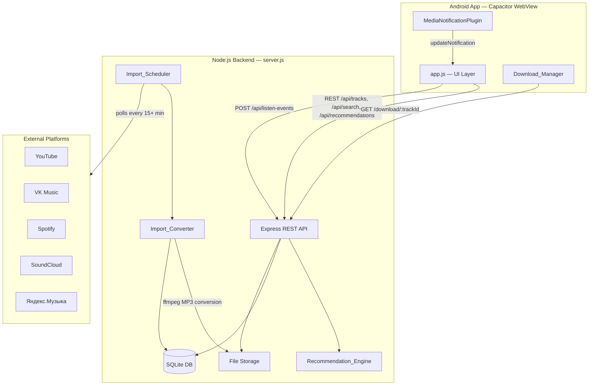
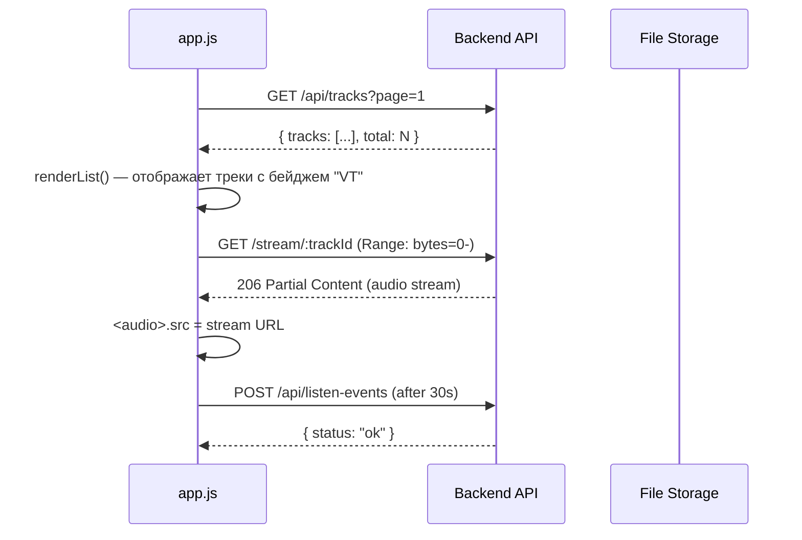
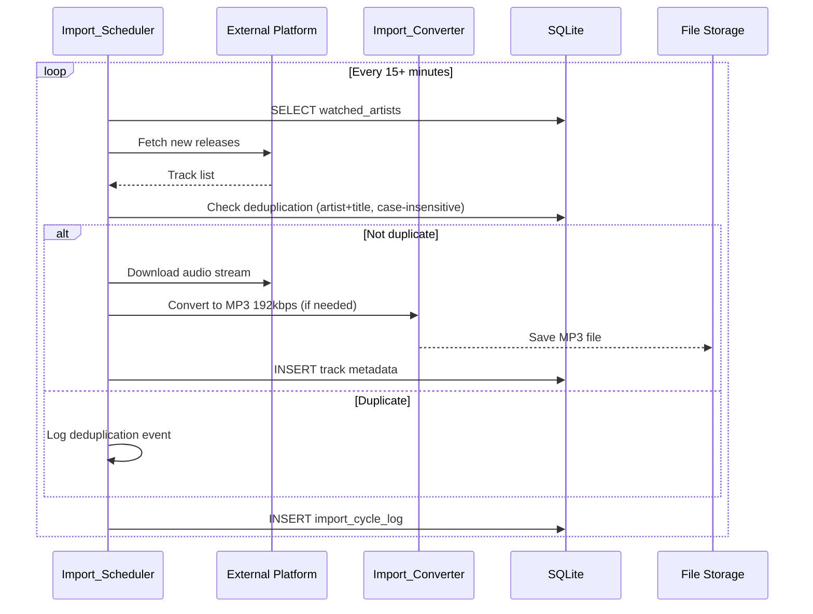

# Design Document: Self-Hosted Music Platform

## Overview

Self-Hosted Music Platform расширяет VioletTunes бэкенд (`backend/server.js`) собственным хранилищем треков, системой рекомендаций на основе истории прослушивания, автоматическим импортом из внешних платформ и возможностью скачивания MP3 на устройство.

Ключевые цели:
- Независимость от YouTube (актуально для РФ)
- Единый UX: self-hosted треки отображаются рядом с YouTube-контентом
- Персональные рекомендации на основе серверной истории прослушивания
- Автоматическое пополнение каталога через Import_Scheduler

### Ключевые технические решения

| Решение | Обоснование |
|---|---|
| Файлы хранятся на диске сервера (не в БД) | Простота деплоя на Render, нет зависимости от S3 |
| SQLite для метаданных и истории | Нет внешних зависимостей, достаточно для одного сервера |
| HTTP Range Requests для стриминга | Стандарт для аудио, поддерживается нативным `<audio>` |
| `yt-dlp` + `ffmpeg` для импорта | Зрелые инструменты, поддерживают все целевые платформы |
| UUID v4 для ID треков | Глобальная уникальность, нет коллизий при импорте |

---

## Architecture



### Модули бэкенда

```
backend/
├── server.js              # Точка входа, Express app, существующие маршруты
├── routes/
│   ├── tracks.js          # GET /api/tracks, GET /api/tracks/:id, GET /stream/:id
│   ├── search.js          # GET /api/search (self-hosted catalog)
│   ├── recommendations.js # GET /api/recommendations, POST /api/listen-events
│   ├── download.js        # GET /download/:trackId
│   ├── import.js          # POST /api/import/playlist-url, GET|POST|DELETE /api/import/oauth/*, GET /api/import/jobs/:jobId
│   └── admin.js           # POST /admin/tracks, POST/DELETE /admin/watched-artists
├── modules/
│   ├── db.js              # SQLite connection + schema migrations
│   ├── trackStore.js      # CRUD операции с треками
│   ├── listenHistory.js   # Запись и чтение событий прослушивания
│   ├── recommendationEngine.js  # Scoring + секции рекомендаций
│   ├── importScheduler.js # Периодический опрос внешних платформ
│   ├── importConverter.js # ffmpeg-обёртка для конвертации в MP3
│   ├── playlistImporter.js      # Логика импорта плейлистов по URL и через OAuth
│   ├── oauthManager.js          # OAuth flow + хранение/обновление/отзыв OAuth_Session
│   └── metadataSerializer.js    # Сериализация/десериализация Track
├── storage/
│   └── tracks/            # Аудиофайлы (MP3/AAC)
└── db/
    └── violettunes.db     # SQLite база данных
```

---

## Components and Interfaces

### REST API Endpoints

#### Track Catalog

```
GET  /api/tracks?page=1&limit=20
     → { tracks: Track[], total: number, page: number, totalPages: number }

GET  /api/tracks/:id
     → Track metadata (JSON)

GET  /stream/:id
     → Audio stream (supports Range header → 206 Partial Content)

GET  /download/:trackId
     → MP3 file (Content-Disposition: attachment)
```

#### Search

```
GET  /api/search?q=<query>&limit=20
     → { tracks: Track[], total: number }
     Errors: 400 if q.length < 2
     Search fields: title, artist, album, lyrics (via SQLite FTS5 tracks_fts)
```

#### Lyrics

```
GET  /api/tracks/:id/lyrics
     → { id: string, lyrics: string | null }
     Errors: 404 if track not found
```

#### Recommendations

```
POST /api/listen-events
     Body: { trackId, sessionId, listenDurationSeconds }
     → { status: "ok" }

GET  /api/recommendations?sessionId=<id>
     → { sections: RecommendationSection[] }
```

#### Admin

```
POST   /admin/tracks                    (X-Admin-Key header required)
       multipart/form-data: file, title, artist, album?, genre?, cover?
       → 201 { id, ...metadata }

POST   /admin/watched-artists           (X-Admin-Key header required)
       Body: { name, platforms: [{ platform, identifier }] }
       → 201 { artistId, name, platforms }

DELETE /admin/watched-artists/:artistId (X-Admin-Key header required)
       → 200 { status: "removed" }
```

#### Playlist Import

```
POST /api/import/playlist-url
     Body: { url: string, sessionId: string }
     → 202 { jobId: string }
     Errors: 400 if URL format is not recognized, 422 if playlist is not accessible

GET  /api/import/oauth/:platform/authorize?sessionId=<id>
     → 302 redirect to platform OAuth authorization page
     Errors: 400 if platform is not one of: vk | spotify | yandex

GET  /api/import/oauth/:platform/callback?code=<code>&state=<sessionId>
     → 200 { status: "authorized", platform }
     Errors: 401 if OAuth code is invalid or expired

GET  /api/import/oauth/:platform/playlists?sessionId=<id>
     → 200 { playlists: Playlist[] }
     Errors: 401 if OAuth_Session not found or expired for sessionId

POST /api/import/oauth/:platform/import
     Body: { sessionId: string, playlistId: string }
     → 202 { jobId: string }
     Errors: 401 if OAuth_Session not found or expired, 404 if playlistId not found

DELETE /api/import/oauth/:platform/session?sessionId=<id>
     → 200 { status: "revoked" }
     Errors: 404 if no session found for sessionId + platform

GET  /api/import/jobs/:jobId
     → 200 { jobId, status, totalTracks, downloadedTracks, skippedTracks, failedTracks, createdAt, updatedAt }
     status: "pending" | "running" | "completed" | "failed" | "auth_expired"
     Errors: 404 if jobId not found
```

### Data Flow: Self-Hosted Track Playback



### Data Flow: Import Scheduler



---

## Data Models

### SQLite Schema

```sql
-- Треки
CREATE TABLE tracks (
    id           TEXT PRIMARY KEY,          -- UUID v4
    title        TEXT NOT NULL,
    artist       TEXT NOT NULL,
    album        TEXT,
    genre        TEXT,
    duration_seconds INTEGER NOT NULL CHECK(duration_seconds > 0),
    cover_url    TEXT,
    lyrics       TEXT,                      -- текст песни (опционально)
    file_path    TEXT NOT NULL,             -- относительный путь в storage/tracks/
    file_size_bytes INTEGER NOT NULL,
    mime_type    TEXT NOT NULL,             -- audio/mpeg | audio/aac
    source       TEXT NOT NULL DEFAULT 'upload',  -- upload | youtube | vk | spotify | soundcloud | yandex
    source_url   TEXT,
    uploaded_at  TEXT NOT NULL,             -- ISO 8601
    imported_at  TEXT,                      -- ISO 8601, только для импортированных
    play_count   INTEGER NOT NULL DEFAULT 0
);

-- FTS5 виртуальная таблица для полнотекстового поиска
CREATE VIRTUAL TABLE tracks_fts USING fts5(
    title,
    artist,
    album,
    lyrics,
    content='tracks',
    content_rowid='rowid'
);

-- История прослушивания
CREATE TABLE listen_events (
    id           INTEGER PRIMARY KEY AUTOINCREMENT,
    track_id     TEXT NOT NULL REFERENCES tracks(id),
    session_id   TEXT NOT NULL,
    listen_duration_seconds INTEGER NOT NULL,
    recorded_at  TEXT NOT NULL             -- ISO 8601
);
CREATE INDEX idx_listen_session ON listen_events(session_id);
CREATE INDEX idx_listen_track   ON listen_events(track_id);

-- Отслеживаемые артисты
CREATE TABLE watched_artists (
    id           TEXT PRIMARY KEY,          -- UUID v4
    name         TEXT NOT NULL,
    created_at   TEXT NOT NULL
);

-- Платформы для отслеживаемых артистов
CREATE TABLE watched_artist_platforms (
    artist_id    TEXT NOT NULL REFERENCES watched_artists(id) ON DELETE CASCADE,
    platform     TEXT NOT NULL,             -- youtube | vk | spotify | soundcloud | yandex
    identifier   TEXT NOT NULL,             -- channel ID, artist ID и т.д.
    PRIMARY KEY (artist_id, platform)
);

-- Лог циклов импорта
CREATE TABLE import_cycle_logs (
    id              INTEGER PRIMARY KEY AUTOINCREMENT,
    started_at      TEXT NOT NULL,
    completed_at    TEXT NOT NULL,
    tracks_checked  INTEGER NOT NULL DEFAULT 0,
    tracks_downloaded INTEGER NOT NULL DEFAULT 0,
    tracks_skipped  INTEGER NOT NULL DEFAULT 0,
    errors_json     TEXT NOT NULL DEFAULT '{}'  -- { platform: errorCount }
);

-- OAuth сессии пользователей (для импорта плейлистов)
CREATE TABLE oauth_sessions (
    id              TEXT PRIMARY KEY,           -- UUID v4
    session_id      TEXT NOT NULL,              -- sessionId пользователя из приложения
    platform        TEXT NOT NULL,              -- vk | spotify | yandex
    access_token    TEXT NOT NULL,
    refresh_token   TEXT,
    expires_at      TEXT NOT NULL,              -- ISO 8601
    created_at      TEXT NOT NULL,              -- ISO 8601
    UNIQUE(session_id, platform)
);
CREATE INDEX idx_oauth_session_platform ON oauth_sessions(session_id, platform);

-- Задачи импорта плейлистов
CREATE TABLE import_jobs (
    id                  TEXT PRIMARY KEY,       -- UUID v4
    session_id          TEXT NOT NULL,
    platform            TEXT NOT NULL,          -- vk | spotify | yandex | url
    playlist_id         TEXT,                   -- ID плейлиста на платформе (NULL для URL-импорта)
    source_url          TEXT,                   -- URL плейлиста (для URL-импорта)
    status              TEXT NOT NULL DEFAULT 'pending',  -- pending | running | completed | failed | auth_expired
    total_tracks        INTEGER NOT NULL DEFAULT 0,
    downloaded_tracks   INTEGER NOT NULL DEFAULT 0,
    skipped_tracks      INTEGER NOT NULL DEFAULT 0,
    failed_tracks       INTEGER NOT NULL DEFAULT 0,
    created_at          TEXT NOT NULL,          -- ISO 8601
    updated_at          TEXT NOT NULL           -- ISO 8601
);
CREATE INDEX idx_import_jobs_session ON import_jobs(session_id);
```

### TypeScript-подобные интерфейсы (для документации)

```typescript
interface Track {
  id: string;                  // UUID v4
  title: string;               // max 200 chars
  artist: string;              // max 100 chars
  album?: string;              // max 100 chars
  genre?: string;              // max 50 chars
  durationSeconds: number;     // positive integer
  coverUrl?: string;
  lyrics?: string | null;      // текст песни, max 50 000 chars
  uploadedAt: string;          // ISO 8601
  source: 'upload' | 'youtube' | 'vk' | 'spotify' | 'soundcloud' | 'yandex';
  sourceUrl?: string;
  playCount: number;
}

interface ListenEvent {
  trackId: string;
  sessionId: string;
  listenDurationSeconds: number;
}

interface RecommendationSection {
  title: string;               // e.g. "Похожие исполнители", "Твой микс"
  tracks: Track[];
}

interface WatchedArtist {
  id: string;
  name: string;
  platforms: Array<{
    platform: 'youtube' | 'vk' | 'spotify' | 'soundcloud' | 'yandex';
    identifier: string;
  }>;
}

interface Playlist {
  id: string;                  // ID плейлиста на платформе
  name: string;
  trackCount: number;
  platform: 'vk' | 'spotify' | 'yandex';
}

interface ImportJob {
  id: string;                  // UUID v4
  sessionId: string;
  platform: 'vk' | 'spotify' | 'yandex' | 'url';
  playlistId?: string;
  sourceUrl?: string;
  status: 'pending' | 'running' | 'completed' | 'failed' | 'auth_expired';
  totalTracks: number;
  downloadedTracks: number;
  skippedTracks: number;
  failedTracks: number;
  createdAt: string;           // ISO 8601
  updatedAt: string;           // ISO 8601
}

interface OAuthSession {
  id: string;                  // UUID v4
  sessionId: string;
  platform: 'vk' | 'spotify' | 'yandex';
  accessToken: string;
  refreshToken?: string;
  expiresAt: string;           // ISO 8601
  createdAt: string;           // ISO 8601
}
```

### Track JSON Schema (сериализация)

```json
{
  "id": "uuid-v4",
  "title": "string",
  "artist": "string",
  "album": "string | null",
  "genre": "string | null",
  "durationSeconds": "positive integer",
  "coverUrl": "string | null",
  "uploadedAt": "ISO 8601 string"
}
```

Обязательные поля: `id`, `title`, `artist`, `durationSeconds`.

---

## Correctness Properties

*A property is a characteristic or behavior that should hold true across all valid executions of a system — essentially, a formal statement about what the system should do. Properties serve as the bridge between human-readable specifications and machine-verifiable correctness guarantees.*

### Property 1: Metadata round-trip

*For any* valid Track metadata object, serializing it to JSON and then deserializing it back SHALL produce an object deeply equal to the original.

**Validates: Requirements 7.4**

---

### Property 2: File format and size validation

*For any* uploaded file, the server SHALL accept it if and only if its MIME type is `audio/mpeg` or `audio/aac` AND its size is ≤ 50 MB; all other files SHALL be rejected with the appropriate HTTP error code.

**Validates: Requirements 1.1, 1.7, 1.8**

---

### Property 3: Pagination invariant

*For any* Track_Catalog of size N and any valid page number P, the response SHALL contain exactly `min(20, N - (P-1)*20)` tracks, and the union of all pages SHALL equal the full catalog without duplicates.

**Validates: Requirements 1.3**

---

### Property 4: Non-existent track returns 404

*For any* UUID that does not exist in the Track_Catalog, a GET request for that ID SHALL return HTTP 404 with a JSON body containing a human-readable `message` field.

**Validates: Requirements 1.5**

---

### Property 5: Range request correctness

*For any* stored track and any valid byte range `[start, end]` within the file, a GET request with `Range: bytes=start-end` SHALL return HTTP 206 with a `Content-Range` header matching the requested range and a body of exactly `end - start + 1` bytes.

**Validates: Requirements 1.6**

---

### Property 6: Case-insensitive search matching

*For any* search query Q and any track T in the catalog whose `title`, `artist`, or `album` contains Q as a substring (case-insensitive), T SHALL appear in the search results for Q.

**Validates: Requirements 2.2**

---

### Property 7: Short query rejection

*For any* search query of length 0 or 1, the server SHALL return HTTP 400 with an error message indicating the minimum query length requirement.

**Validates: Requirements 2.5**

---

### Property 8: Recommendation scoring formula

*For any* set of listen history entries for a given sessionId, the Score computed by Recommendation_Engine for each track SHALL equal `playCount * 2.0 + (totalListenMinutes * 1.0) * recencyDecay(lastPlayedAt)`, where `recencyDecay` applies a half-life of 7 days.

**Validates: Requirements 4.3**

---

### Property 9: Recommendation ordering and exclusion

*For any* sessionId with ≥ 3 listen events, the recommendations response SHALL contain tracks sorted by Score in descending order, and SHALL NOT include any track that was played in the current session.

**Validates: Requirements 4.4**

---

### Property 10: Listen event persistence round-trip

*For any* listen event `{ trackId, sessionId, listenDurationSeconds }` sent to the server, the event SHALL be retrievable from the Listen_History store by `sessionId` and `trackId`.

**Validates: Requirements 4.2**

---

### Property 11: Admin auth — unauthorized requests rejected

*For any* request to `POST /admin/tracks`, `POST /admin/watched-artists`, or `DELETE /admin/watched-artists/:id` that is missing or has an invalid `X-Admin-Key` header, the server SHALL return HTTP 401.

**Validates: Requirements 6.1, 6.2, 8.4**

---

### Property 12: Upload round-trip

*For any* valid track upload (valid audio file + required metadata fields), the server SHALL return HTTP 201 with the new track's `id` and metadata, and a subsequent GET `/api/tracks/:id` SHALL return the same metadata.

**Validates: Requirements 6.3**

---

### Property 13: Required field validation on upload

*For any* upload request missing `title` or `artist`, the server SHALL return HTTP 400 with a descriptive validation error.

**Validates: Requirements 6.4, 6.5**

---

### Property 14: UUID uniqueness

*For any* number of track uploads, all generated track IDs SHALL be distinct UUIDs.

**Validates: Requirements 6.6**

---

### Property 15: durationSeconds validation

*For any* track metadata where `durationSeconds` is not a positive integer (i.e., is zero, negative, a float, or a non-numeric type), the server SHALL reject the metadata.

**Validates: Requirements 7.5**

---

### Property 16: Import deduplication (case-insensitive)

*For any* track already present in the Track_Catalog, an import attempt for a track with the same `artist` and `title` (compared case-insensitively) SHALL be skipped, and a deduplication event SHALL be logged.

**Validates: Requirements 8.9**

---

### Property 17: Watched artist add/remove round-trip

*For any* artist added via `POST /admin/watched-artists`, the artist SHALL appear in the Watched_Artists list; after a subsequent `DELETE /admin/watched-artists/:artistId`, the artist SHALL no longer appear in the list.

**Validates: Requirements 8.2, 8.3**

---

### Property 18: FTS поиск по lyrics

*For any* track T in the Track_Catalog whose `lyrics` field contains a word W (case-insensitive), a search query for W SHALL include T in the results returned by `GET /api/search?q=W`.

**Validates: Requirements 2.3, 9.1**

---

### Property 19: Playlist URL import — все треки попадают в каталог

*For any* valid public playlist URL from VK, Spotify, or Яндекс.Музыка containing N accessible tracks, after the Playlist_Import job completes, the Track_Catalog SHALL contain all N tracks (minus any that were already present before the import, counted as skipped), and `downloadedTracks + skippedTracks + failedTracks` SHALL equal N.

**Validates: Requirements 10.1, 10.2, 10.8**

---

### Property 20: OAuth сессия — после logout токен недействителен

*For any* OAuth_Session that has been revoked via `DELETE /api/import/oauth/:platform/session`, any subsequent request to `GET /api/import/oauth/:platform/playlists` using the same sessionId SHALL return HTTP 401, regardless of whether the access token itself has not yet expired on the platform side.

**Validates: Requirements 10.11, 10.12**

---

## Error Handling

### HTTP Error Codes

| Ситуация | HTTP код | Тело ответа |
|---|---|---|
| Трек не найден | 404 | `{ error: "Track not found", message: "..." }` |
| Lyrics не найдены (трек отсутствует) | 404 | `{ error: "Track not found", message: "..." }` |
| Файл > 50 MB | 413 | `{ error: "File too large", message: "Max size is 50 MB" }` |
| Неверный формат файла | 400 | `{ error: "Invalid format", message: "Only MP3 and AAC are supported" }` |
| Отсутствует X-Admin-Key | 401 | `{ error: "Unauthorized" }` |
| Отсутствует title/artist | 400 | `{ error: "Validation error", fields: [...] }` |
| Поисковый запрос < 2 символов | 400 | `{ error: "Query too short", minLength: 2 }` |
| Ошибка сервера | 500 | `{ error: "Internal server error" }` |

### Стратегии обработки ошибок

**Import_Scheduler:**
- Недоступная платформа → логировать + пропустить платформу в текущем цикле, повторить в следующем
- Недоступный трек → логировать + пропустить трек, не повторять в том же цикле
- Ошибка конвертации → логировать + удалить частичный файл, пропустить трек

**Android App:**
- Music_Server недоступен → toast + fallback на YouTube-контент (Requirement 3.6)
- Ошибка скачивания → toast + сохранить частичный файл для повтора (Requirement 5.5)
- Попытка скачать уже существующий файл → диалог подтверждения (Requirement 5.6)

**Metadata deserialization:**
- Отсутствует обязательное поле → логировать ошибку + исключить трек из API-ответов (Requirement 7.3)

---

## Testing Strategy

### Подход

Используется двойная стратегия тестирования:
- **Unit/property tests** — проверяют логику сервера (сериализация, валидация, scoring, поиск)
- **Integration tests** — проверяют HTTP-эндпоинты, файловую систему, SQLite

### Property-Based Testing

Библиотека: **[fast-check](https://github.com/dubzzz/fast-check)** (Node.js)

Каждый property-тест запускается минимум **100 итераций**.

Тег формата: `// Feature: self-hosted-music-platform, Property N: <text>`

Покрытие свойств:

| Property | Модуль | Тип генератора |
|---|---|---|
| P1: Metadata round-trip | `metadataSerializer.js` | `fc.record({ id: fc.uuid(), title: fc.string(), ... })` |
| P2: File format/size validation | `admin.js` route | `fc.record({ size: fc.integer(), mimeType: fc.string() })` |
| P3: Pagination invariant | `trackStore.js` | `fc.array(trackArb)`, `fc.integer({ min: 1 })` |
| P4: Non-existent track 404 | `tracks.js` route | `fc.uuid()` (filtered to not exist) |
| P5: Range request correctness | `tracks.js` route | `fc.integer({ min: 0 })` for byte ranges |
| P6: Case-insensitive search | `search.js` | `fc.string()` for queries + track generators |
| P7: Short query rejection | `search.js` | `fc.string({ maxLength: 1 })` |
| P8: Recommendation scoring | `recommendationEngine.js` | `fc.array(listenEventArb)` |
| P9: Recommendation ordering | `recommendationEngine.js` | `fc.array(listenEventArb, { minLength: 3 })` |
| P10: Listen event round-trip | `listenHistory.js` | `fc.record({ trackId: fc.uuid(), sessionId: fc.uuid(), ... })` |
| P11: Admin auth rejection | all admin routes | `fc.option(fc.string())` for API key |
| P12: Upload round-trip | `admin.js` route | valid track generator |
| P13: Required field validation | `admin.js` route | track generator with missing fields |
| P14: UUID uniqueness | `trackStore.js` | `fc.integer({ min: 1, max: 100 })` upload count |
| P15: durationSeconds validation | `metadataSerializer.js` | `fc.oneof(fc.float(), fc.integer({ max: 0 }), fc.string())` |
| P16: Import deduplication | `importScheduler.js` | track generator with case variants |
| P17: Watched artist round-trip | `admin.js` route | `fc.record({ name: fc.string(), platforms: ... })` |
| P18: FTS search by lyrics | `search.js` | track generator with lyrics + word queries |
| P19: Playlist URL import completeness | `playlistImporter.js` | playlist generator with N tracks, dedup variants |
| P20: OAuth session revocation | `oauthManager.js` | `fc.record({ sessionId: fc.uuid(), platform: fc.constantFrom(...) })` |

### Unit Tests (example-based)

- Fallback рекомендаций при < 3 событиях (Requirement 4.6)
- Пустой результат поиска возвращает `{ tracks: [], total: 0 }` (Requirement 2.3)
- Корректные заголовки `/download/:trackId` (Content-Disposition, Content-Type)
- Формат имени файла при скачивании: `{artist} - {title}.mp3`

### Integration Tests

- Полный цикл загрузки трека: upload → stream → download
- Import_Scheduler: мок внешней платформы → проверка записи в БД
- Недоступный Music_Server → fallback в Android-приложении
- Производительность: `/api/search` отвечает < 1 с при каталоге 10 000 треков

### Android Integration

- `MediaNotificationPlugin.updateNotification` вызывается при смене self-hosted трека
- Бейдж "VT" отображается на self-hosted треках в списке
- Download_Manager: не более 3 одновременных загрузок

### Экран "Импорт плейлиста" (Android)

Экран доступен из главного меню приложения и содержит:

- **Поле ввода URL** — пользователь вставляет ссылку на публичный плейлист VK, Spotify или Яндекс.Музыки; кнопка "Импортировать" запускает `POST /api/import/playlist-url`
- **Кнопки OAuth-авторизации** — по одной для каждой платформы: "Войти через VK", "Войти через Spotify", "Войти через Яндекс.Музыку"; при нажатии открывается WebView с OAuth-страницей платформы
- **Список плейлистов** — после успешной OAuth-авторизации отображается список плейлистов пользователя (название, количество треков); пользователь выбирает плейлист и нажимает "Импортировать"
- **Прогресс импорта** — во время выполнения задачи отображается прогресс-бар и текст вида "Скачано: {downloadedTracks} из {totalTracks}"; данные обновляются через polling `GET /api/import/jobs/:jobId` каждые 2 секунды
- **Кнопка "Выйти"** — рядом с каждой авторизованной платформой; вызывает `DELETE /api/import/oauth/:platform/session` и скрывает список плейлистов этой платформы
- **Toast по завершении** — "Импортировано: {downloadedTracks} треков, пропущено: {skippedTracks}"

### Lyrics UI (Android Player)

Когда играет Self-Hosted_Track, в плеере отображается кнопка "Текст":

- Кнопка "Текст" делает запрос `GET /api/tracks/:id/lyrics` при первом нажатии
- При `lyrics !== null` — показывает scrollable блок с текстом под элементами управления плеером
- При повторном нажатии — скрывает блок (toggle)
- При `lyrics === null` — кнопка отображается в disabled-состоянии
- При смене трека — блок скрывается, кнопка сбрасывается в исходное состояние
